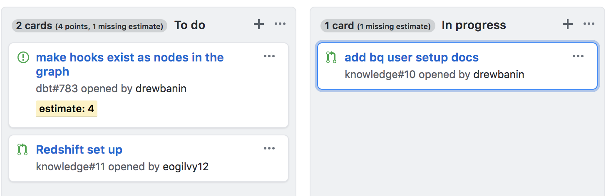

# GitHub Projects Story Points

A Chrome Extension to add [story points](https://en.wikipedia.org/wiki/Planning_poker) totals to [GitHub Projects](https://help.github.com/articles/about-projects/) columns.

You can estimate issues by adding a tag like `estimate: 2`. The number will be converted into a tag at the top of the project column.

This extension will also show the number of unestimated issues in a project.

## To Install

1. Download all the files in the directory.
1. Launch Chrome
1. Open chrome://extensions/
1. Make sure "Developer mode" is CHECKED
1. Click "Load unpacked extension..."
1. Select the directory you downloaded all the files to.

**GitHub Projects Story Points** should now appear in your Extensions lists

1. Reload the extension page or click the "Reload" link under **GitHub Projects Story Points**
1. Open your Projects page on github.com
1. Enjoy!
